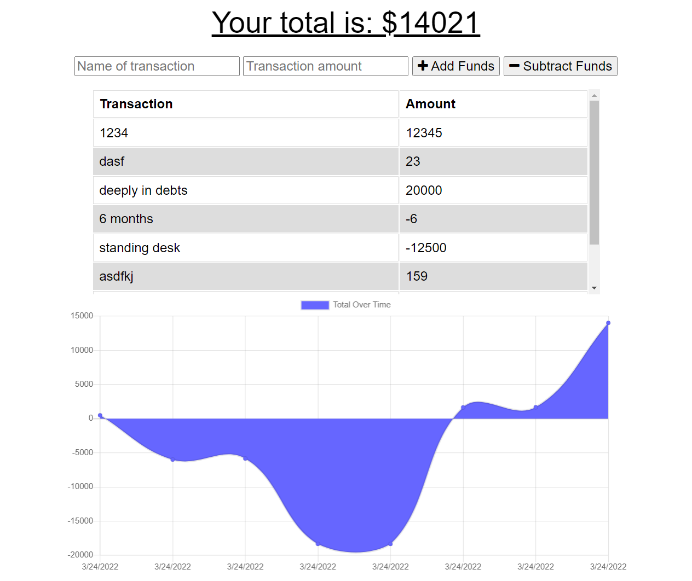

# Mobile_budget_tracker

## Description

This is a simple budgeting app that is focussed on PWA usability. It uses IndexedDB to cache data so it can be used offline and then easily updated when connection is regained.

## Table of Contents

1. [Description](#description)
2. [Installation](#installation)
3. [Usage](#usage)
4. [Image](#screenshot)
5. [Collaboration](#collaboration)
6. [Tests](#tests)
7. [Questions?](#questions?)
8. [GitHub](#gitHub)
9. [License](#license)

## Installation

- `git clone ` application to your local machine.
- `npm i `
- `npm start`
  

## Usage

Name your transaction and add or subtract the amount you wish. In Dev tools, you can disable network (go offline) and the app will store all the data and resync it when connection is reestablished.

## Screenshot

[

## Collaboration

For now, just follow the [Contributor Covenant](https://www.contributor-covenant.org/)

## Tests

none yet

## Questions?

Please contact me at

- Zachary Clark [GitHub](https://github.com/zaclark369)

## Credits

